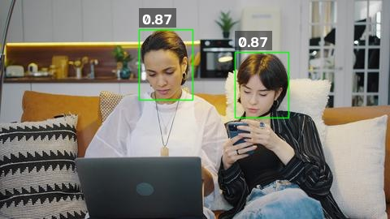
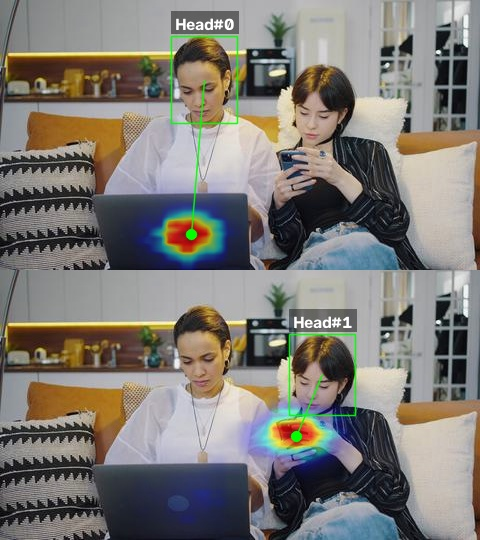
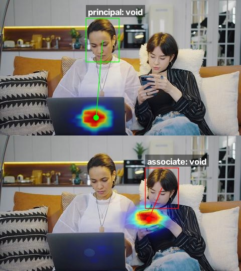

# SeetaPsych Gaze Follow

> SeetaPsych 注视跟随算法模块，检测场景中的人头并估计每人的注视目标——画面中的注视落点与人物间社交注视关系。

简体中文 | [English](README.md)

[](pyproject.toml)
[](LICENSE)

## 使用方式

本项目已纳入 seetapsych-lib 默认配置，直接通过 `seetapsych-manager download` 即可下载使用。

具体用法请参考 [SeetaPsych](https://github.com/seetapsych/seetapsych-lib) 主库文档。

安装可选算法依赖：

```bash
uv pip install seetapsych-gaze-follow[all]
```

算法模块会在首次使用时自动从 ModelScope 下载模型权重，因此初次运行可能因模型下载而速度较慢。

如需额外加载本项目的算法模块，可通过以下方式：

### WebUI

运行 `seetapsych-webui` 时通过 `--files` 参数加载：

```
seetapsych-webui --files \
  seetapsych_gaze_follow/modules/head_detection.yml \
  seetapsych_gaze_follow/modules/cosi.yml
```

### 编程调用

在代码中添加以下内容以加载并使用本算法模块：

```python
from seetapsych_lib.runtime.factory import Factory
from seetapsych_lib.runtime.pipeline import Pipeline

factory = Factory()
factory.load_file_modules("seetapsych_gaze_follow/modules/head_detection.yml")
factory.load_file_modules("seetapsych_gaze_follow/modules/cosi.yml")

pipeline = Pipeline(factory, ...)

pipeline.add_attributes("head/detection", "head/gaze_point")
# 如需双人社交注视：
# pipeline.add_attributes('head/detection', 'head/social_gaze')
```

完整的端到端示例（含可视化效果）参见：

* [examples/image_head_detection.py](examples/image_head_detection.py) — 静态图像多人头检测，附置信度标签。
* [examples/image_gaze_point.py](examples/image_gaze_point.py) — 静态图像逐人注视跟随，附逐人热力图面板。
* [examples/image_social_gaze.py](examples/image_social_gaze.py) — 静态图像双人社交注视关系分类，附逐人堆叠面板。
* [examples/video_social_gaze.py](examples/video_social_gaze.py) — 社交注视的离线视频批量渲染，保持原始 FPS 与分辨率。

### 模块列表

| YAML 路径 | 算法包 |
|---|---|
| [head_detection.yml](seetapsych_gaze_follow/modules/head_detection.yml) | HeadDetection-CoSIGaze, HeadSelection |
| [cosi.yml](seetapsych_gaze_follow/modules/cosi.yml) | SceneGazeFollow-CoSIGaze, SocialGaze-CoSIGaze |

## 模块流水线

注视跟随流水线由两个阶段组成，分别从独立的模块配置文件加载：

1. **HeadDetection**（[head_detection.yml](seetapsych_gaze_follow/modules/head_detection.yml)）— 多人头检测器，以及可选的 HeadSelection 后处理模块。
2. **CoSI**（[cosi.yml](seetapsych_gaze_follow/modules/cosi.yml)）— 置信度协调空间集成（Confidence-coordinated Spatial Integration, CoSI）模型，用于注视点预测与社交注视关系分类。

依赖关系：
- `head/detection` → `head/gaze_point`（单人注视跟随）
- `head/detection` → `head/social_gaze`（双人社交注视，要求检测到的头部数量 ≥ 2）

### HeadDetection

基于 Ultralytics YOLO 的多人头检测器，支持可插拔的筛选与排序后处理，作为 CoSI 注视跟随模型的前端输入。

<div align="center" id="figure-headdet-result">
  
  <p><em><strong>图 1</strong> HeadDetection 输出可视化 — 多人头边界框及每框置信度评分。</em></p>
</div>

模块配置：[head_detection.yml](seetapsych_gaze_follow/modules/head_detection.yml)

| 算法包名称 | 提供属性 | 依赖属性 |
|---|---|---|
| HeadDetection-CoSIGaze | `head/detection` | *(无)* |
| HeadSelection | `head/selection`, `head/detection` | `head/detection` |

#### HeadDetection-CoSIGaze

**说明**：多人头检测器，置信度与非极大值抑制（NMS）阈值均可配置；输出人头边界框，供后续 CoSI 注视跟随与社交注视算法包消费。

**参数**

| 名称 | 类型 | 默认值 | 说明与调优建议 |
|---|---|---|---|
| img_size | integer | 640 | 推理输入图像尺寸。值越大，小人头召回率越高，但延迟与显存占用也随之增加；请保持为 32 的倍数（640 为均衡默认值）。 |
| conf | number | 0.25 | 最低检测置信度阈值。在拥挤场景中可适当调高以减少误报（典型值 0.35–0.5）；在远处或遮挡较多的人头场景中可适当降低以恢复更多目标（典型值 0.15–0.2）。 |
| iou | number | 0.45 | 用于重复抑制的 NMS IoU 阈值。较低值（0.3–0.4）可在密集人群中去除更多重叠框；较高值（0.5–0.6）可对间距较小的头部保留更多候选。 |
| max_det | integer | 20 | NMS 后每帧保留的检测框上限。按场景中同时出现人数的预期上限设置（如双人场景设为 2–4，观众场景设为 10–20），避免下游引入噪声。 |

**模型**

| 名称 | 推荐 |
|---|---|
| seeta-gaze-follow-yolo_head.pt | ✓ |

**输出属性**
- `head/detection` — [规格定义](https://github.com/seetapsych/seetapsych-attributes#headdetection)。

#### HeadSelection

**说明**：后处理模块，按尺寸或置信度筛选前 N 个人头检测结果，再按空间顺序（左右/上下）排序后传入下游注视跟随或社交注视模块。

**参数**

| 名称 | 类型 | 默认值 | 筛选方式 | 说明与调优建议 |
|---|---|---|---|---|
| count | integer | 1 | — | 筛选后保留的人头数量；请与场景中实际跟踪人数匹配，如单人目标设为 1，双人社交注视分析设为 2。 |
| method | selection | max_size | max_size, max_confidence | 挑选前 N 个头部的准则。`max_size` 倾向于距离最近或尺寸最大的头部（前景主导人物）；当遮挡较少且检测分数可信时，可使用 `max_confidence`。 |
| sort | selection | left-right | left-right, right-left, top-bottom, bottom-top | 筛选后应用的空间排序。`left-right` 符合屏幕阅读顺序，推荐用于双人社交注视（左 = 主视角人物 principal，右 = 关联人物 associate）；垂直堆叠布局更适合 `top-bottom`。 |

**模型**：*(无)*

**输出属性**
- `head/selection` — [规格定义](https://github.com/seetapsych/seetapsych-attributes#headselection)。
- `head/detection` — [规格定义](https://github.com/seetapsych/seetapsych-attributes#headdetection)。

### CoSIGaze

基于 CoSI 变换器架构，从单张 RGB 场景图像完成多人注视跟随与双人社交注视关系分类。

模块配置：[cosi.yml](seetapsych_gaze_follow/modules/cosi.yml)

| 算法包名称 | 提供属性 | 依赖属性 |
|---|---|---|
| SceneGazeFollow-CoSIGaze | `head/gaze_point` | `head/detection` |
| SocialGaze-CoSIGaze | `head/social_gaze` | `head/detection` |

#### SceneGazeFollow-CoSIGaze

<div align="center" id="figure-gazepoint-result">
  
  <p><em><strong>图 2</strong> SceneGazeFollow 输出可视化 — 逐人堆叠面板分别显示该头部的注视热力图、视线与目标点。</em></p>
</div>

<div align="center" id="video-gazepoint-demo">
  <video src="https://github.com/user-attachments/assets/ecf5ec9c-23de-4343-b8d7-7e79db2d83ca" controls style="max-width: 100%; max-height: 480px;"></video>
  <p><em><strong>视频 1</strong> SceneGazeFollow 视频演示 — 逐帧注视跟随，附注视热力图、视线与目标点。</em></p>
</div>

**说明**：基于 CoSI 变换器的逐人场景级注视跟随；对每个输入人头框返回原图上的 2D 注视目标点（`gaze_point_px`）以及逐像素注视热力图。

**参数**：*(无)*

**模型**

| 名称 | 推荐 |
|---|---|
| seeta-gaze-follow-cosi_weights.pth | ✓ |

**输出属性**
- `head/gaze_point` — [规格定义](https://github.com/seetapsych/seetapsych-attributes#headgaze_point)。

#### SocialGaze-CoSIGaze

<div align="center" id="figure-socialgaze-result">
  
  <p><em><strong>图 3</strong> SocialGaze 输出可视化 — 主视角（绿色）与关联人物（红色）面板，各含逐人热力图、注视目标与社交注视关系标签。</em></p>
</div>

**说明**：基于共享 CoSI 变换器主干的双人社交注视关系分类器；选取按水平排序后置信度最高的前 2 个头部（左 = 主视角人物 principal，右 = 关联人物 associate），预测 5 类输出 share、mutual、single、miss、void，同时输出逐人注视点与热力图。

**参数**：*(无)*

**模型**

| 名称 | 推荐 |
|---|---|
| seeta-gaze-follow-cosi_weights.pth | ✓ |

**输出属性**
- `head/social_gaze` — [规格定义](https://github.com/seetapsych/seetapsych-attributes#headsocial_gaze)。

**SocialGaze 类别映射**（`social_gaze_id` → `social_gaze_label`）：

| ID | 标签 |
|---|---|
| 0 | share |
| 1 | mutual |
| 2 | single |
| 3 | miss |
| 4 | void |
